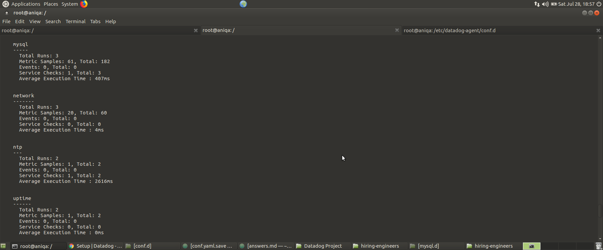
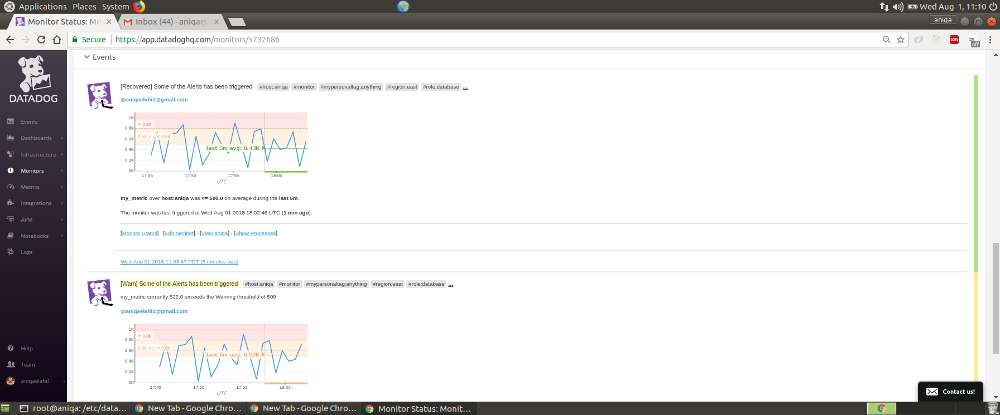

###                Virtualization

>What is Oracle Virtual Machine?
>Oracle VM is a free and open source solution to run other operating system in your PC.

>what is virtualization?
>It is a process of running different Operating Systems on your PC(reffered to as host) while the resulting VM manager can be used to create as many virtual boxes as needed and are reffered to as guests.


>In a simple way we can define process of virtualization as 'Virtual Machine' is a guest house which can have one or many guest rooms,
 where a guest(any Operating System) can perform as if its his home.

###                                   Setting Virtual Machine and linux Operating System
To install Oracle Virtual Machine on my PC, simply go to this link
https://www.virtualbox.org/wiki/Dowlaods
I chose `Windows Hosts` since my PC has Windows OS. Then I followed the following steps(Please note I am installing this for the sake of showing how I did this earlier my VM already has virtual box that I used to complete this lab)

1. Once download is complete
2. 
3. !

###                                   COLLECTING METRICS

Operating System: GNU/Linux (Ubunto 64-bit)/ Oracle VM VirtualBox

Agent: Datadog Agent: v6.3.3

####          Setting Up Datadog Account and installing Agent on the local machine

I first created a datadog account using this link https://app.datadoghq.com/signup.
Once the datadog account was created, I used menu to select `Agent` (you could also use this link https://app.datadoghq.com/account/settings#agent)


Based on my OS, I selected Ubuntu (select one based on your operating system).


I then copied and pasted the "One-Step Install" command in the terminal's root directory and executed the command.
It took some time to install the `Agent` on my system.
Once installed, I used the command given in step 2 to update/upgrade the `Agent`.

#### Image showing Datadog Agent installed and running

   

 At this stage, I navigated to the datadog account where I was able to observe the dashboard (which was provided as a link in the Events tab of the menu options)

 

 ```
                    IMPORTANT TERMINAL COMMANDS
        1. sudo datadog-agent status # will show current status of the Agent
        2. sudo systemctl start datadog-agent # will start the Agent
        3. sudo systemctl stop datadog-agent # will stop the Agent

```

>  Question. Add tags in the Agent config file and show us a screen shot of your host and its tags on the Host Map page in Datadog.

In the terminal, I switched to super user mode (since I installed Datadog agent as super user i.e su)
 ``` ~$ sudo su [and provide password]
 ~$ cd /etc/datadog-agent
 ```
 Once in the datadog-agent directory, I opened the  datadog.yaml file using `Nano`(Command-Line text editor)

`root@aniqa/etc/datadog-agent://# nano datadog.yaml`

I located the `tags:` in the yaml file and changed it from comment to a command (by removing the `#` character).
Here, I added additional tags (Note: Predefined or custom tags can be added, ideally key-value pairs like `region:east` etc).


I then checked datadog account by navigating to the
`infrastructure/Host Map` within the menu options and could see all the tags that I had defined in `yaml` file previously.


> Challenges: I was unable to see the tags after configuring them in the yaml file initially but after a couple of attempts they appeared. This possibly happened due to the delay in the datadog Agent system check.

> Question. Install a database on your machine (MongoDB, MySQL, or PostgreSQL) and then install the respective Datadog integration for that database?

#####  MySQL installation in the terminal

Steps for MySQL installation in the terminal are as follows:

1. $ sudo su [provide password]     
2. $ sudo apt-get install mysql
3. $ sudo netstat -tap | grep mysql  # instead of step 2 this command could be used to either start an already existing database or create a new one
4. Inside datadog account I navigated to `integrations` menu option and selected `mysql`. It showed all the steps to integrate `mysql` in the local environment.
Which were given as follows:


             a. mysql> GRANT REPLICATION CLIENT ON *.* TO  'datadog'@'localhost' WITH MAX_USER_CONNECTIONS 5;

             b. mysql> GRANT PROCESS ON *.* TO 'datadog'@'localhost';

             c. mysql> show databases like 'performance_schema'

             d. mysql> GRANT SELECT ON performance_schema.* TO 'datadog'@'localhost';


5.  I added the configuration block to `/etc/datadog-agent/conf.d` to start gathering metrics

              init_config:

                instances:
                  - server: localhost
                    user: datadog
                    pass: mypassword
                    tags:
                        - mysql_tag1
                        - mysql_tag2
                    options:
                        replication: 0
                        galera_cluster: 1


6. I restarted the `Agent` to check the status. I was able to see that
       mysql had been integrated.



 7. Similarly, in the datadog account I could see installed `mysql` as shown in the following image.


Following image showed `MySQL` graph on the dashboard


>Challenges:
>  + This section took me a lot of time each time when I have to restart the agent after writing in mysql.yaml file, the agent became  completely unresponsive and I was unable to connect with the datadog server until I had to uninstall the agent and redo everything again.
I later realized that it was due to me using Agent v5 and not upgrading it. Once I upgraded everything started working smoothly.
>  + I was not defining the tags in mysql.yaml file since I thought they were optional and it was giving me errors but when I added them It got configured correctly.


>Question. Create a custom Agent check that submits a metric named my_metric with a random value between 0 and 1000?

    Adding a custom check was quiet simple I just had to create two files in the following two folders. One important thing is to give the same name to both files.

       a. /etc/datadog-agent/conf.d
       b. /etc/datadog-agent/checks.d

a. In conf.d I created a file name custom-check.yaml


    and simply added the following `code`

       ```     
        init_config:
                instances:
                    [{}]
      ```             


Got an error message in my custom-check.py file


 > Error message:- It appeared that the error was due to indentation of block which, once fixed, started showing me custom checks as expected.   

b. In checks.d I created a file custom-check.py
  the checks inherits from the AgentCheck class, I also import random class to be able to generate a random number to be passed through metric, "my_metric"

        ```
                from checks import AgentCheck
                import random
                class HelloCheck(AgentCheck):
                    def check(self, instance):
                        self.gauge('my_metric',random.randint(0,1000))
         ```


  Finally I stoped and then restarted the agent to see the checks being added


>Question:- Change your check's collection interval so that it only submits the metric once every 45 seconds?

We can add min_collection_interval to help define how often the check should be run globally by Agent. If it is greater than the interval time for the Agent collector, a line is added to the log stating that collection for this script was skipped. The default is 0 which means it’s collected at the same interval as the rest of the integrations on that Agent.

If the value is set to 45, it does not mean that the metric is collected every 45 seconds, but rather that it could be collected as often as every 45 seconds.
In Agent 6, min_collection_interval must be added at an instance level, and can be configured individually for each instance.
Simply add the min_collection_interval: 45 in the custom-check.yaml file(since I am using Agent V6,for v5 its slightly different).

```
      init_config:

      instances:
        - min_collection_interval: 45

```


To see my custom check I ran the following command in terminal

     ```

     $ sudo -u dd-agent -- datadog-agent check custom-check

     ```


> Yes, since we can specify our custom collection interval in the YAML and not in the Python file.


###                               VISUALIZING DATA


Utilize the Datadog API to create a Timeboard that contains:

     a. Your custom metric scoped over your host.
     b. Any metric from the Integration on your Database with the anomaly function applied.
     c. Your custom metric with the rollup function applied to sum up all the points for the past hour into one bucket
-----------------------------------------------------------------------------------
I created a ruby gem for this problem using Bundler inside my hiring-engineers repo, created a ruby gem with the following command

       a. bundle gem codingruby
       b. once a gem is being created I added the following two gems in the Gemfile
             `gem 'dogapi'`
             `gem 'dogstatsd-ruby'``
        $ bundle install   #will install the above gems
       c. Inside lib folder I have now a file codingruby.rb where I will place my `code`.


      Go to your Datadog account and navigate to Settings/API(https://app.datadoghq.com/account/settings#api), where you can see an Api key but you have to create an Application key by specifying a name for your app in order to make Api calls


After looking at related datadogs api endpoints(which can help create, update, delete and query timeboards).

 And it has the following arguments
   - title [required]
   - description [required]
   - graph [optional]
      graph follows this form :
        - title[required]
        - definition[optional]
        - template_variables [optional, default=None]:
            - name[required]
            - prefix[optional]
            - default[optional]
    with a post request which is being made to `https://api.datadoghq.com/api/v1/dash`

  I create a ruby file and added the following `code` in it


     In Order to create a timeboard I consulted the following resource link

     https://docs.datadoghq.com/integrations/mysql/#metrics (A resource for finding mysql functions)

   Related code is in [code/timeboard-creation.rb]
    ```
                require "codingruby/version"
                require 'rubygems'
                require 'dogapi'
                module Codingruby

                  api_key = "******************************"
                  app_key = "**********************************"

                  dog = Dogapi::Client.new(api_key, app_key)

                  # Create a timeboard.

                  title = 'My Metrics'

                  description = 'And they are marvelous.'

                  graphs = [{

# The following code will produce a graph with the average free Memory space and willpresent it in timeseries

                            "definition" => {
                          "events" => [],
                          "requests" => [{ "q" => "avg:system.mem.free{*} "}],
                          "viz" => "timeseries"
                      },"title" => "Average Memory Free "},

 # The following code will produce a graph with the average free Memory space and will present it in heatmap

                  {

                    "definition" => {
                        "events" => [],
                        "requests" => [{"q" => "avg:system.mem.free{*}" }],
                        "viz" => "heatmap"
                    },
                    "title" => "Average Memory Free In heatmap"},

  # The following code will produce a graph to show my_metric(custom check) in  timeseries, what is asked in the question

                    {
                      "definition" => {
                          "events" => [],
                          "requests" => [{"q" => "my_metric{*} by {host}" }],
                          "viz" => "timeseries"
                      },
                      "title" => "My custom Metric my_metric"},
# The following code will produce a graph showing mysql performance cpu time over time anomaly function
                      {
                        "definition" => {
                            "events" => [],
                            "requests" => [{"q" => "anomalies(avg:mysql.performance.cpu_time{host:aniqa}, 'basic', 1)" }],
                            "viz" => "timeseries"
                        },
                        "title" => "Database Metric with an anomaly function "},

  # The following code will produce a graph showing my_metric by applying rollup function to show the average of event in the past hour in a timeseries graph

                      {
                        "definition" => {
                            "events" => [],
                            "requests" => [{ "q" => "avg:my_metric{host:aniqa}.rollup(avg,120)" }],
                            "viz" => "timeseries"
                        },
                        "title" => "Rollup function applied to  sum of my_metric"

                }]
                  template_variables = [{
                      "name" => "host1",
                      "prefix" => "host",
                      "default" => "host:my-host"
                  }]

                  dog.create_dashboard(title, description, graphs, template_variables)

                end

```          

after saving the above code simply run the following command in your terminal

      >$ rspec lib/codingruby.rb

  Now go back to datadog agent and you can see a new timeboard.


     


    a. Set the Timeboard's timeframe to the past 5 minutes

    This part is quite easy, just go to dashboard and move the graph pointer to 5 minutes before.
    

  Bonus Question: What is the Anomaly graph displaying?
    Anomaly detection is a strategy to see whats normal and whats not.
    Any abnormal changes whether they are high in value or low are shown on anomaly graph as red. Anomaly detection functions evaluate on the basis of trends and set a range on the basis of past events(range shown in light blue area). For example have a look at 
    we can clearly spot that the mysql performance cpu time against system time was most of the time out of normal range(In light blue)
    and was represented with red color.


#                                       Monitoring Data

   Create a new Metric Monitor that watches the average of your custom metric (my_metric) and will alert if it’s above the following values over the past 5 minutes:
           Warning threshold of 500
           Alerting threshold of 800
           And also ensure that it will notify you if there is No Data for this query over the past 10m.

Ans.  This was an easy part all I did to go to dashboard and clicked settings button on the graph showing my_metric and chose
  "create monitor" option a new window popped up,
  
```
  I added values
         a. Alert threshold : 800
         b. Warning threshold: 500
         c. chose "Notify"if data is missing for more than "10"(added 10 in the textbox) minutes  
```


  ### Please configure the monitor’s message so that it will:
         Send you an email whenever the monitor triggers.
         Create different messages based on whether the monitor is in an Alert, Warning, or No Data state.
         Include the metric value that caused the monitor to trigger and host ip when the Monitor triggers an Alert state.
         When this monitor sends you an email notification, take a screenshot of the email that it sends you.

    For this section I used predefined tags like {{#is_warning}}Appropriate message{{/#is_warning}}


 Moreover, I also selected my name in `Notify your team`


    We can see this monitor by going to monitors and clicking the monitor you want to see





    Moreover, Alerts will also appear on the dashboard.


    ### Bonus Question: Since this monitor is going to alert pretty often, you don’t want to be alerted when you are out of the office. Set up two scheduled downtimes for this monitor:

    >  a. One that silences it from 7pm to 9am daily on M-F,
          Simply go to Monitors and click on "Manage Downtime"
              

          once saved it can be viewed by selecting it in the manage downtime window as shown in the following picture


      >b. And one that silences it all day on Sat-Sun.

         I created another downtime event as followed,


          I had to do some calculations since my Friday downtime will start at 7:pm and will stay until Saturday morning so I started the weekend downtime from 9:00 am Saturday and specified a duration of 48 hours.

![downtime weekend][images/monitoring-data/downtime-weekend-2.png]
               -----------------------------------

      >c.  Make sure that your email is notified when you schedule the downtime and take a screenshot of that notification.
          I received email notification


###                                   Collecting APM Data:

    Given the following Flask app (or any Python/Ruby/Go app of your choice) instrument this using Datadog’s APM solution.

    I created a rails app in my directory and followed the documentation provided by datadog

         $ rails new DataDogApmRails # will create a rails app

    The Ruby APM tracer sends trace data through the Datadog Agent

   1. Go to datadog account and navigate to APM, choose docs and select framework for example I chose 'Rails'


   I followed the instruction as follows

   a. added "gem 'ddtrace'" in the gem file and then install it using " $ bundle install"

   b. created a datadog-tracer.rb file in  config/initializers, and put the following code in it
      ```
         Rails.configuration.datadog_trace = {
           auto_instrument: true,
           auto_instrument_redis: true,
           default_service: 'my-rails-app',
           tracer: Datadog.tracer

         }
      ```   


        Code can be seen in the 'DataDogApmRails/initializers/datadog-tracer.rb' file

    c. In datadog-agent/datadog.yaml remove the comment from

     ```
              apm_config:
              enabled:true
     ```

  2.  I also created a controller using
     ```
      $ rails g controller welcome
    ```
      which provided me a controllers/welcome_controller.rb and a views folder(since rails is an MVC(Model View Controller) framework)

      I defined index action in the welcome_controller.rb and then created a related index.html.erb file with some simple text in it.

     Related code is in 'DataDogApmRails/app/controllers/welcome_controller.rb' file

  3. Also defined routes in [DataDogApmRails/config/routes.rb]
     Finally I ran the rails server by '$ rails s'  and went back to my datadog account to see the changes.

 #shows the services
  #shows the traces
 #shows the service map


  4. To test how APM shows errors, I added 2 errors inside config/routes.rb file and the APM Monitor started showing it


 Moreover, we can also export APM graphs to any monitor of our choice by selecting the settings button and choosing export


>Question:-    What is the difference between a Service and a Resource?

  A service is a set of processes that do the same job. while a resource is a particular action for a service. A service is self-contained and independently deployed and developed software, which can provide services using different resources.


#                                           Recommended use of Datadog
                                           --------------------------
    I am currently working with disabled kids and the one thing I would love to have is the ability to monitor the causes of what I observe. For example, sometimes a kid will have many seizures in a day while other days they will have no seizures. Similarly with their behaviors, I would love to monitor the food they consume and the noise level affecting their behaviors. So proper measures can be taken.             
