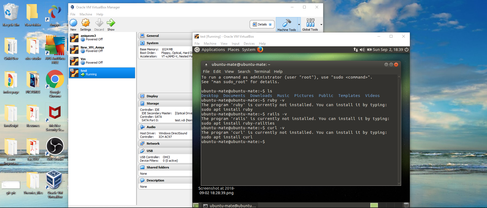

###                Virtualization

>What is Oracle Virtual Machine?
>Oracle VM is a free and open source solution to run other operating systems in your PC.

>What is virtualization?
>It is a process of running different Operating Systems on your PC (referred to as a host) while the resulting VM manager can be used to create as many virtual boxes as needed. Theses are referred to as guests.

>A simple way to define the process of virtualization as a 'Virtual Machine' is a guest house which can have one or many guest rooms,
 where a guest (any Operating System) can live/perform as if they are in their home.

###                                   SETTING UP THE VIRTUAL MACHINE MANAGER TO USE LINUX OS

To install the `Oracle Virtual Machine` on my PC I went to the following link
https://www.virtualbox.org/wiki/Dowlaods.

Then I chose `Windows Hosts` since my PC has Windows OS. Then I followed the following steps:

>Please note I am installing this for the sake of showing how I did this earlier, where I not only installed Virtual Machine but also installed the Ubuntu OS.  

1. Once the download was complete, I chose `New` to create a new Virtual Box named 'test'


2. I kept default settings in this part


3. I then hit the `create` button.


4. I selected `dynamically allocate` and hit `Next`


I kept the default option of `test` to save the hard drive and hit `create`.

5. The virtual box was created. However, I could see the other virtual boxes as well since I had been working in another 'virtual box'  where I did all my assignment.


6. A new text box appeared prompting me to select `virtual optical disk` file.


 I selected the `browser icon` and then selected the file shown in the following image.

 

After selecting the file, I hit `start`.

 

7. Finally the virtual box `test` was created with a welcome message ( Note: Since I was using Virtual Manager before creating this virtual box, I didn't have to install `ubuntu` at this time).

 

8. The following image shows virtual box `test` running.


9. I could now select the terminal and start working in it


10. The following image shows the `Command Line Interface/terminal`


11. At this point my system had nothing installed. I planned to work in Ruby, Rails and Atom (text editor) so I will install them using `sudo apt-get install name-of-software`



>The easiest way to check if a system has a language installed is to use software -v command (where v stands for version)

12. I tried to install ruby by using `$ sudo apt-get install ruby`, it didn't install `Ruby` instead a system update was suggested. I then updated the system by `$ sudo apt-get update`.
Once system updated I installed ruby with no difficulty using `$ sudo apt-get install ruby`.


###                            SETTING UP GIT IN THE LINUX TERMINAL

In order to complete `Datadog Solutions Engineer` assignment, I had to configure Git in my new Virtual box
that I just created in the above section.

>What is GitHub? GitHub is an open source version control system (VCS) commonly known as Git. It is responsible for everything
GitHub-related that happens locally on our computers

1. I order to use Github one has to have an account on Github.
2. I used `command line` command to install git in my local environment using

 `$ sudo apt-get install git`

 

 checking git version

 

3. After installing the git in my local environment, I had to connect it with the remote GitHub server which I accomplished by creating a `SSH key`, more info in
this link (https://help.github.com/articles/connecting-to-github-with-ssh/).

 `$ ssh-keygen -t rsa -b 4096 -C "my_email@example.com"`

 I simply press enter for all the prompt e.g passphrase and location.

  

  The following image shows key generated

   

I opened this key using `$ cat .ssh/id_rsa.pub`, it showed a long key that I copied to use in my github account.

4. Next I started ssh agengt in the backgroung

`$ eval "$(ssh-agent -s)"`

 

 5. I then used the key (from step 3) and added it to my github account, now I was connected to GitHub and was abl
 to do all the actions.
 I then clone the Datadog hiring-engineers repository in my terminal using `$ git clone repository-name`
 and started working on it.

###                                   COLLECTING METRICS

Operating System: GNU/Linux (Ubunto 64-bit)/ Oracle VM VirtualBox

Agent: Datadog Agent: v6.3.3

####          Setting Up Datadog Account and installing Agent on the local machine

I first created a datadog account using this link https://app.datadoghq.com/signup.
Once the datadog account was created, I used menu to select `Agent` (you could also use this link https://app.datadoghq.com/account/settings#agent)


Based on my OS, I selected Ubuntu (select one based on your operating system).


I then copied and pasted the "One-Step Install" command in the terminal's root directory and executed the command.
It took some time to install the `Agent` on my system.
Once installed, I used the command given in step 2 to update/upgrade the `Agent`.

#### Image showing Datadog Agent installed and running

   

 At this stage, I navigated to the datadog account where I was able to observe the dashboard (which was provided as a link in the Events tab of the menu options)

 

 ```
                    IMPORTANT TERMINAL COMMANDS
        1. sudo datadog-agent status # will show current status of the Agent
        2. sudo systemctl start datadog-agent # will start the Agent
        3. sudo systemctl stop datadog-agent # will stop the Agent

```

>  Question. Add tags in the Agent config file and show us a screen shot of your host and its tags on the Host Map page in Datadog.

In the terminal, I switched to super user mode (since I installed Datadog agent as super user i.e su)
 ``` ~$ sudo su [and provide password]
 ~$ cd /etc/datadog-agent
 ```
 Once in the datadog-agent directory, I opened the  datadog.yaml file using `Nano`(Command-Line text editor)

`root@aniqa/etc/datadog-agent://# nano datadog.yaml`

I located the `tags:` in the yaml file and changed it from comment to a command (by removing the `#` character).
Here, I added additional tags (Note: Predefined or custom tags can be added, ideally key-value pairs like `region:east` etc).


I then checked datadog account by navigating to the
`infrastructure/Host Map` within the menu options and could see all the tags that I had defined in `yaml` file previously.


> Challenges: I was unable to see the tags after configuring them in the yaml file initially but after a couple of attempts they appeared. This possibly happened due to the delay in the datadog Agent system check.

> Question. Install a database on your machine (MongoDB, MySQL, or PostgreSQL) and then install the respective Datadog integration for that database?

#####  MySQL installation in the terminal

Steps for MySQL installation in the terminal are as follows:

1. $ sudo su [provide password]     
2. $ sudo apt-get install mysql
3. $ sudo netstat -tap | grep mysql  # instead of step 2 this command could be used to either start an already existing database or create a new one
4. Inside datadog account I navigated to `integrations` menu option and selected `mysql`. It showed all the steps to integrate `mysql` in the local environment.
Which were given as follows:

             a. mysql> sudo mysql -e "CREATE USER 'datadog'@'localhost' IDENTIFIED BY 'passord'


             b. mysql> GRANT REPLICATION CLIENT ON *.* TO  'datadog'@'localhost' WITH MAX_USER_CONNECTIONS 5;

             b. mysql> GRANT PROCESS ON *.* TO 'datadog'@'localhost';

             c. mysql> show databases like 'performance_schema'

             d. mysql> GRANT SELECT ON performance_schema.* TO 'datadog'@'localhost';


5.  I added the configuration block to `/etc/datadog-agent/conf.d` to start gathering metrics

              init_config:

                instances:
                  - server: localhost
                    user: datadog
                    pass: mypassword
                    tags:
                        - mysql_tag1
                        - mysql_tag2
                    options:
                        replication: 0
                        galera_cluster: 1


6. I restarted the `Agent` to check the status. I was able to see that
       mysql had been integrated.


 7. Similarly, in the datadog account I could see installed `mysql` as shown in the following image.


Following image showed `MySQL` graph on the dashboard


>Challenges:
>  + Configuring MySQL consumed a lot of time whenever I had to restart the agent after editing mysql.yaml file; the agent used to become completely unresponsive and I couldn't connect to the datadog server until I uninstalled the agent and reapeated the above steps.
I later realized that this happened because I was using Agent v5 without upgrading it. Once I upgraded everything started working smoothly.
>  + I was not defining the tags in mysql.yaml file since I thought they were optional and it was giving me errors but when I added them it worked fine.


>Question. Create a custom Agent check that submits a metric named my_metric with a random value between 0 and 1000?

Adding a custom check was quite simple, I just had to create two files in the following two folders.
> One important consideration is to give the same name to both files.

    *   a. /etc/datadog-agent/conf.d
    *   b. /etc/datadog-agent/checks.d

a. In conf.d I created a file named custom-check.yaml
and simply added the following code

```     
        init_config:
                instances:
                    [{}]
```             


I then got an error message in my custom-check.py file


> Error message:- It appeared that the error was due to indentation of block which, once fixed, started showing me custom checks as expected.   

b. In `checks.d` I created a file `custom-check.py`
  where the checks inherit from the `AgentCheck class`.
   I also imported `random class` to generate a random number to be passed through the metric `my_metric`.

```            
 from checks import AgentCheck
      import random
      class HelloCheck(AgentCheck):
      def check(self, instance):
      self.gauge('my_metric',random.randint(0,1000))
```


  Finally I stopped and then restarted the agent to see the checks being added.


>Question:- Change your check's collection interval so that it only submits the metric once every 45 seconds?

We can add `min_collection_interval` to help define how often the check should be run globally by Agent. If it is greater than the interval time for the Agent collector, a line is added to the log stating that collection for this script was skipped. The default is 0 which means it is collected at the same interval as the rest of the integrations on that Agent.

If the value is set to 45, it does not mean that the metric is collected every 45 seconds, but rather that it could be collected as often as every 45 seconds.
In `Agent 6`, `min_collection_interval` must be added at an instance level, and can be configured individually for each instance.
Simply add the min_collection_interval: 45 in the custom-check.yaml file (since I am using Agent V6,for v5 its slightly different).

```
      init_config:

      instances:
        - min_collection_interval: 45

```


To see my custom check I ran the following command in the terminal.

`$ sudo -u dd-agent -- datadog-agent check custom-check`


>Bonus Question:
> Answer: Yes, since we can specify our custom collection interval in the YAML and not in the Python file.


###                               VISUALIZING DATA


Utilize the Datadog API to create a Timeboard that contains:

     a. Your custom metric scoped over your host.
     b. Any metric from the Integration on your Database with the anomaly function applied.
     c. Your custom metric with the rollup function applied to sum up all the points for the past hour into one bucket

I created a ruby gem for this problem using `Bundler` inside my `hiring-engineers` repo using the following command

a. `$ bundle gem codingruby`
b. Once a gem was created, I added the following two gems in the Gemfile

`gem 'dogapi'`
`gem 'dogstatsd-ruby'`

then I ran `$ bundle install` to install the above gems.

c. Inside `lib` folder I had a file called `codingruby.rb` where I placed my `code`.

I then went back to the Datadog account and navigated to `Settings/API` (https://app.datadoghq.com/account/settings#api), where I could see an `Api key` but I still had to create an `Application key` which I accomplished by specifying a name for the `app` in order to make Api calls.


After looking at related datadogs api endpoints (which can help create, update, delete and query timeboards), I found the following syntax to  make API calls.

 ```
   - title [required]
   - description [required]
   - graph [optional]
      graph follows this form :
        - title[required]
        - definition[optional]
        - template_variables [optional, default=None]:
            - name[required]
            - prefix[optional]
            - default[optional]
    with a post request which is being made to `https://api.datadoghq.com/api/v1/dash`
```
I created a ruby file and added the following `code` in it


In Order to create a timeboard I consulted the following resource link

https://docs.datadoghq.com/integrations/mysql/#metrics (A resource for finding mysql functions)

>Related code is in [code/timeboard-creation.rb]

```
                require "codingruby/version"
                require 'rubygems'
                require 'dogapi'
                module Codingruby

                  api_key = "******************************"
                  app_key = "**********************************"

                  dog = Dogapi::Client.new(api_key, app_key)

                  # Create a timeboard.

                  title = 'My Metrics'

                  description = 'And they are marvelous.'

                  graphs = [{

   # The following code will produce a graph with the average free Memory space and will present it in the form of time series

                            "definition" => {
                          "events" => [],
                          "requests" => [{ "q" => "avg:system.mem.free{*} "}],
                          "viz" => "timeseries"
                      },"title" => "Average Memory Free "},

   # The following code will produce a graph with the average free Memory space and will present it in heatmap

                  {

                    "definition" => {
                        "events" => [],
                        "requests" => [{"q" => "avg:system.mem.free{*}" }],
                        "viz" => "heatmap"
                    },
                    "title" => "Average Memory Free In heatmap"},

    # The following code will produce a graph to show my_metric(custom check) in  timeseries, what is asked in the question

                    {
                      "definition" => {
                          "events" => [],
                          "requests" => [{"q" => "my_metric{*} by {host}" }],
                          "viz" => "timeseries"
                      },
                      "title" => "My custom Metric my_metric"},
    # The following code will produce a graph showing mysql performance cpu time over time anomaly function
                      {
                        "definition" => {
                            "events" => [],
                            "requests" => [{"q" => "anomalies(avg:mysql.performance.cpu_time{host:aniqa}, 'basic', 1)" }],
                            "viz" => "timeseries"
                        },
                        "title" => "Database Metric with an anomaly function "},

     # The following code will produce a graph showing my_metric by applying rollup function to show the average of event in the past hour in a timeseries graph

                      {
                        "definition" => {
                            "events" => [],
                            "requests" => [{ "q" => "avg:my_metric{host:aniqa}.rollup(avg,120)" }],
                            "viz" => "timeseries"
                        },
                        "title" => "Rollup function applied to  sum of my_metric"

                }]
                  template_variables = [{
                      "name" => "host1",
                      "prefix" => "host",
                      "default" => "host:my-host"
                  }]

                  dog.create_dashboard(title, description, graphs, template_variables)

                end
```          

After saving the above code I simply ran the following command in the terminal to execute ruby code, which will make a call to the `Datadog API` to create a timeboard.

`                 $ rspec lib/codingruby.rb`

Now I went back to my datadog account and could see a new timeboard.


     


>Question:- Set the Timeboard's timeframe to the past 5 minutes

This part is quite easy, just go to dashboard and move the graph pointer to 5 minutes before.


>Question:- Take a snapshot of this graph and use the @ notation to send it to yourself.

    Now I clicked one of the graphs, clicked camera, wrote a message, used `@myemail@yahoo.com` and pressed enter. I received a full board, with the graph I picked, more visibly.


>Bonus Question: What is the Anomaly graph displaying?
    Anomaly detection is a strategy to see whats normal and whats not.
    Any abnormal changes whether they are high in value or low are shown on the anomaly graph as red. Anomaly detection functions evaluate on the basis of trends and set a range on the basis of past events (range shown in light blue area). For example have a look at


    we can clearly spot that the mysql performance cpu time against system time was out of normal range (in light blue) most of the time
    and was represented with red color.


###                                       MONITORING DATA

>Question:- Create a new Metric Monitor that watches the average of your custom metric (my_metric) and will alert if it’s above the following values over the past 5 minutes:
           Warning threshold of 500
           Alerting threshold of 800
           And also ensure that it will notify you if there is No Data for this query over the past 10m.

This part was simple. All I did was go to the dashboard and select the settings button on the graph showing `my_metric` and chose the `create monitor` option. A new window popped up,


```
  I added values
         a. Alert threshold : 800
         b. Warning threshold: 500
         c. I chose "Notify"if data is missing for more than "10"(added 10 in the textbox) minutes  
```


>Question:- Please configure the monitor’s message so that it will:
         Send you an email whenever the monitor triggers.
         Create different messages based on whether the monitor is in an Alert, Warning, or No Data state.
         Include the metric value that caused the monitor to trigger and host ip when the Monitor triggers an Alert state.
         When this monitor sends you an email notification, take a screenshot of the email that it sends you.

For this section, I used predefined tags like `{{#is_warning}}appropriate message/s goes here{{/#is_warning}}`.


 Moreover, I also selected my name in `Notify your team` (my name was the only option available).


I was then able to see this monitor by going to the `Monitors` menu tab and selecting the monitor.


Alerts can also be seen under `Events` as well.


Alerts showed on dashboard.


> Bonus Question: Since this monitor is going to alert pretty often, you don’t want to be alerted when you are out of the office. Set up two scheduled downtimes for this monitor:

>a. One that silences it from 7pm to 9am daily on M-F,

I simply went to the `Monitors` (menu tab) and click on `Manage Downtime`. I then provided desired values as shown in the following image:


I then saved the above settings so they could be viewed by selecting it in the `manage downtime` window as shown in the following image:


>b. And one that silences it all day on Sat-Sun.

I created another downtime event as shown in the following image:


I had to do some calculations since my Friday downtime will start at `7:00 PM` and will stay until Saturday morning `9:00 AM`. I started the weekend downtime from `9:00` am Saturday and specified a duration of `48 hours`.


>c.  Make sure that your email is notified when you schedule the downtime and take a screen shot of that notification.

I then received email notifications as shown in the following images:


###                                   COLLECTING APM DATA:

>Question:- Given the following Flask app (or any Python/Ruby/Go app of your choice) instrument this using Datadog’s APM solution.

I created a rails app in my directory and followed the documentation provided by datadog

`$ rails new DataDogApmRails`  will create a rails app

The `Ruby APM tracer` sends trace data through the Datadog Agent

   1. In my datadog account, I navigated to `APM` menu tab, chose `docs` and selected a framework. For example I chose `Rails`.


I implemented the instruction as follows:

a. I added `gem 'ddtrace'` in the `DataDogApmRails/Gemfile` and then installed it using `$ bundle install`

b. I created a `datadog-tracer.rb` file in  `DataDogApmRails/config/initializers`, and placed the following code in it

```
         Rails.configuration.datadog_trace = {
           auto_instrument: true,
           auto_instrument_redis: true,
           default_service: 'my-rails-app',
           tracer: Datadog.tracer  }
```   


>Code can be seen in the DataDogApmRails/initializers/datadog-tracer.rb file

c. Inside `datadog-agent/datadog.yaml`, I made `comment to command` by removing the `#` character as follows.

```
              apm_config:
              enabled:true
```

2.  I also created a `controller` with the name `welcome` using

```
      $ rails g controller welcome
```

which provided me a `controllers/welcome_controller.rb` and a `views` folder (since rails is an MVC, Model View Controller framework).  
I then defined `index action` in the `welcome_controller.rb` and then created a related view action file named `index.html.erb` with some simple text in it.

> Code can be seen in the DataDogApmRails/app/controllers/welcome_controller.rb file

3. I also defined routes in `DataDogApmRails/config/routes.rb`.
Finally I ran the rails server by `$ rails s`  and went back to my datadog account to see the changes.

The following image shows the `services`:


The following image shows the `traces`:

  

The following image shows the `map`:


The following image shows the `WelcomeController#index` which was just created:


4. To test how APM shows errors, I added 2 errors inside config/routes.rb file and the `APM Monitor` started showing it.


>Moreover, we can also export APM graphs to any monitor of our choice by selecting the settings button and choosing export

>Question:-    What is the difference between a Service and a Resource?
>A service is a set of processes that do the same job. while a resource is a particular action for a service. A service is self-contained and independently deployed and developed software, which can provide services using different resources.

###                                          RECOMMENDED USE OF DATADOG SERVICES

>I am currently working with disabled kids and the one thing I would love to have is the ability to monitor the causes of what I observe. For example, sometimes a kid will have many seizures in a day while other days they will have no seizures. Similarly with their behaviors, I would love to monitor the food they consume and the noise level affecting their behaviors. So proper measures can be taken.             
