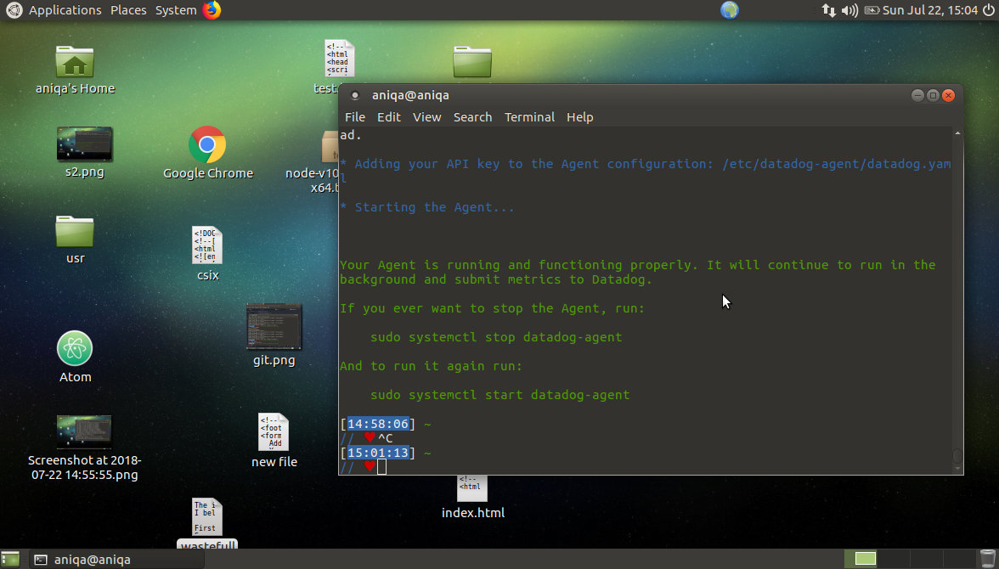

                                   ## COLLECTING METRICS

Operating System: GNU/Linux (Ubunto 64-bit)/ Oracle VM VirtualBox
Agent: Datadog Agent: v6.3.3

                          ## Setting Up Datadog Account and installing Agent on the local machine

https://app.datadoghq.com/signup create a free Account.

Either go from menu to "Agent" or use this link https://app.datadoghq.com/account/settings#agent.

I picked Ubuntu(pick one depending on your system)
Copy and paste the "One-Step Install" command in your terminal root directory and press <Enter>
It will take some time to install it on your system, once Installed
Get the other command to upgrade it which is specified in step 2.
   ###### Image showing Datadog Agent installed and Running
   

 Now navigate to the datadog account where you can see the dashboard[link] appear in Events[menu option]

 [images/collecting-metrics/datadog-dashboard.png]

 ----------------------------------------------------------
                    IMPORTANT TERMINAL COMMANDS
        1. sudo datadog-agent status # will show current status of our Agent
        2. systemctl start datadog-agent # will start our Agent
        3. systemctl stop datadog-agent # will stop our Agent
      NOTE: I have used <code></code> to show the code only, this tag is not meant to be included in the actual code  

 ----------------------------------------------------------

 Q1.Add tags in the Agent config file and show us a screen shot of your host and its tags on the Host Map page in Datadog.

 In the terminal
 sudo su [and provide password]
 root@aniqa://#cd /etc/datadog-agent/
 once in datadog-agent open datadog.yaml file

root@aniqa/etc/datadog-agent://# nano datadog.yaml

scroll down all the way where you can see "tags:" and
uncomment it. Here one can add tags(predefined or custom), ideally key-value pair like region:east etc

[images/collecting-metrics/tag-assignment-datadog-yaml.png]

Then go back to the datadog account and navigate to
infrastructure/Host Map and you can see all the tags that I just defined in yaml file

[images/collecting-metrics/tagsOnHostMap.png]

Challenges: I was unable to see the tags after configuring them in the yaml file initially but after a couple of attempts they appeared.

-----------------------------------------------------------

Q. Install a database on your machine (MongoDB, MySQL, or PostgreSQL) and then install the respective Datadog integration for that database?

Mysql Installation in the terminal
     1. sudo su [provide password]
     2. $ sudo apt-get install mysql # provide   password
     3. $ sudo netstat -tap | grep mysql  # instead of step 2 you can use this command to either start an already existing database or create a new one
     4. Inside datadog account navigate to integrations menu option and select "mysql" It shows all the steps to integrate mysql on the local environment.
     Following steps provide I need to grant some privileges to Agent to collect metrics, which can be done by the following

             a. mysql> GRANT REPLICATION CLIENT ON *.* TO  'datadog'@'localhost' WITH MAX_USER_CONNECTIONS 5;
                   [settingPrevillagesInMysql.png]
             b. mysql> GRANT PROCESS ON *.* TO 'datadog'@'localhost';
                   [settingPrevillages2.png]
             c. mysql> show databases like 'performance_schema'
                   [showdbasPerf.png]
             d. mysql> GRANT SELECT ON performance_schema.* TO 'datadog'@'localhost';

7.  Add the configuration block to /etc/datadog-agent/conf.d to start gathering metrics

    <code>
          init_config:

                instances:
                  - server: localhost
                    user: datadog
                    pass: mypassword
                    tags:
                        - mysql_tag1
                        - mysql_tag2
                    options:
                        replication: 0
                        galera_cluster: 1
        </code>                  

             [mysql-yaml.png]
   8. Restart the agent and check the status and you can see
       mysql has been integrated.

       [images/collecting-metrics/mysql-configured-correctly.png]
       [images/collecting-metrics/dashboard-after-mysql-integration.png]

      Challenges:
          + This section took me a lot of time each time when I have to restart the agent after writing code in mysql.yaml file, the agent became  completely unresponsive and I was unable to connect with the datadog server until I had to uninstall the agent and redo everything again.
          I later realized that it was due to me using Agent v5 and not upgrading it. Once I upgraded everything started working smoothly.
          + I was not defining the tags in mysql.yaml file since I thought they were optional and it was giving me errors but when I added them It got configured correctly.

          ----------------------------------------------------------------------

    Q. Create a custom Agent check that submits a metric named my_metric with a random value between 0 and 1000?

    Adding a custom check was quite simple I just had to create two files in the following two folders. One important thing is to give the same name to both files.
       a. /etc/datadog-agent/conf.d
       b. /etc/datadog-agent/checks.d

a. In conf.d I created a file name custom-check.yaml
    [images/collecting-metrics/custom-check.yaml]
    and simply added the following code
       <code>
                init_config:

                instances:
                    [{}]
          </code>              
        [images/collecting-metrics/custom-check-yaml-file.png]

#Got an error message in my custom-check.py file [images/collecting-metrics/custom-check-error-later-version] //note I encountered this error while I was re doing everything again from scratch using above steps, It appeared that the error was due to indentation of block which, once fixed, started showing me custom checks as expected.   

b. In checks.d I created a file custom-check.py
  the checks inherits from the AgentCheck class, I also import random class to be able to generate a random number to be passed through metric, "my_metric"

        <code>
                from checks import AgentCheck
                import random
                class HelloCheck(AgentCheck):
                    def check(self, instance):
                        self.gauge('my_metric',random.randint(0,1000))
         </code>
      [images/collecting-metrics/custom-check-py-file.png]
  Finally you can stop and restart the agent to see the checks being added
        [images/collecting-metrics/custom-check.png]

----------------------------------------------------------------------------

Q. Change your check's collection interval so that it only submits the metric once every 45 seconds?

We can add min_collection_interval to help define how often the check should be run globally by Agent. If it is greater than the interval time for the Agent collector, a line is added to the log stating that collection for this script was skipped. The default is 0 which means it’s collected at the same interval as the rest of the integrations on that Agent.

 If the value is set to 45, it does not mean that the metric is collected every 45 seconds, but rather that it could be collected as often as every 45 seconds.

In Agent 6, min_collection_interval must be added at an instance level, and can be configured individually for each instance.

Simply add the min_collection_interval: 45 in the custom-check.yaml file(since I am using Agent V6,for v5 its slightly different). now Agent will collect

<code>
      init_config:

      instances:
        - min_collection_interval: 45

</code>

[images/collecting-metrics/changing-interval.png]

To see my custom check rum the following command in terminal

     $ sudo -u dd-agent -- datadog-agent check custom-check

[images/collecting-metrics/running-custom-check.png]
[images/collecting-metrics/status-showing-tags-and-mysql.png] // This image is from second time setting up system

-----------------------------------------------------------------------------------

 Yes, since we can specify our custom collection interval in the YAML and not in the Python file.

                          -------------------------
                               VISUALIZING DATA
                          -------------------------

Utilize the Datadog API to create a Timeboard that contains:

     a. Your custom metric scoped over your host.
     b. Any metric from the Integration on your Database with the anomaly function applied.
     c. Your custom metric with the rollup function applied to sum up all the points for the past hour into one bucket
-----------------------------------------------------------------------------------
I created a ruby app for this problem using Bundler inside my hiring-engineers repo, created a ruby gem with the following command

       a. bundle gem codingruby
       b. once a gem is being created I added the following two gems in the Gemfile
             gem 'dogapi'
             gem 'dogstatsd-ruby'
        $ bundle install   #will install the above gems
       c. Inside lib folder I have now a file codingruby.rb where I will place my code.

      Goto to your Datadog account and navigate to Settings/API(https://app.datadoghq.com/account/settings#api), where you can see an Api key but you have to create an Application key by specifying a name for your app in order to make Api calls
      [images/visualizing-data/api_app_key.png]

After looking into related datadogs api endpoint which help create , update delete and query Timeboards.

 And it has the following arguments
   - title [required]
   - description [required]
   - graph [optional]
      graph follows this form :
        - title[required]
        - definition[optional]
        - template_variables [optional, default=None]:
            - name[required]
            - prefix[optional]
            - default[optional]
    A post request is being made to "https://api.datadoghq.com/api/v1/dash"

  Create a ruby file and add the following code in it
  [use api_key and app_key inside ruby file  ]
     [images/visualizing-data/ruby-file-api-call.png]

     In Order to create a timeboard I consulted the following resource link
    [ https://docs.datadoghq.com/integrations/mysql/#metrics] [resource for finding mysql functions]

 see code in [code/timeboard-creation.rb]
  <code>
                require "codingruby/version"
                require 'rubygems'
                require 'dogapi'
                module Codingruby

                  api_key = "******************************"
                  app_key = "**********************************"

                  dog = Dogapi::Client.new(api_key, app_key)

                  # Create a timeboard.

                  title = 'My Metrics'

                  description = 'And they are marvelous.'

                  graphs = [{

# The following code will produce a graph with the average free Memory space and willpresent it in timeseries

                            "definition" => {
                          "events" => [],
                          "requests" => [{ "q" => "avg:system.mem.free{*} "}],
                          "viz" => "timeseries"
                      },"title" => "Average Memory Free "},

 # The following code will produce a graph with the average free Memory space and will present it in heatmap

                  {

                    "definition" => {
                        "events" => [],
                        "requests" => [{"q" => "avg:system.mem.free{*}" }],
                        "viz" => "heatmap"
                    },
                    "title" => "Average Memory Free In heatmap"},

  # The following code will produce a graph to show my_metric(custom check) in  timeseries, what is asked in the question

                    {
                      "definition" => {
                          "events" => [],
                          "requests" => [{"q" => "my_metric{*} by {host}" }],
                          "viz" => "timeseries"
                      },
                      "title" => "My custom Metric my_metric"},
# The following code will produce a graph showing mysql performance cpu time over time anomaly function
                      {
                        "definition" => {
                            "events" => [],
                            "requests" => [{"q" => "anomalies(avg:mysql.performance.cpu_time{host:aniqa}, 'basic', 1)" }],
                            "viz" => "timeseries"
                        },
                        "title" => "Database Metric with an anomaly function "},

  # The following code will produce a graph showing my_metric by applying rollup function to show the average of event in the past hour in a timeseries graph

                      {
                        "definition" => {
                            "events" => [],
                            "requests" => [{ "q" => "avg:my_metric{host:aniqa}.rollup(avg,120)" }],
                            "viz" => "timeseries"
                        },
                        "title" => "Rollup function applied to  sum of my_metric"

                }]
                  template_variables = [{
                      "name" => "host1",
                      "prefix" => "host",
                      "default" => "host:my-host"
                  }]

                  dog.create_dashboard(title, description, graphs, template_variables)

                end

</code>          

after saving the above code simply run in your terminal

      $ rspec lib/codingruby.rb

  Now go back to datadog agent and you can see a new timeboard.

  [images/visualizing-data/timeboard-created.png]
  [images/visualizing-data/custom-timeboard-created-from-ruby-file.png]
  images/visualizing-data/getting-custom-metric.png     
  [images/visualizing-data/rollup-function-applied-to-custom-metric.png]

  ----------------------------------------------------------------------------
    a. Set the Timeboard's timeframe to the past 5 minutes
    This part is quite easy, just go to dashboard and move the graph pointer to 5 minutes before.
    [images/visualizing-data/timeboard-five-min-ago.png]

    b. Take a snapshot of this graph and use the @ notation to send it to yourself.

    Now I clicked one of the graph and clicked camera, wrote a message, used @myemail@yahoo.com and pressed enter. I recieved a full board, with the graph I picked, more visibly.

     [images/visualizing-data/email-sending.png]
     [images/visualizing-data/email-showing-graph.png]

  Bonus Question: What is the Anomaly graph displaying?
    Anomaly detection is a strategy to see whats normal and whats not.
    Any abnormal changes whether they are high in value or low are shown on anomaly graph as red. Anomaly detection functions evaluate on the basis of trends and set a range on the basis of past events(range shown in light blue area). For example have a look at [images/visualizing-data/anomaly-summary.png]
    we can clearly spot that the mysql performance cpu time against system time was most of the time out of normal range(In light blue)
    and was represented with red color.

                               --------------------------------
                                       Monitoring Data
                               --------------------------------
   Create a new Metric Monitor that watches the average of your custom metric (my_metric) and will alert if it’s above the following values over the past 5 minutes:
           Warning threshold of 500
           Alerting threshold of 800
           And also ensure that it will notify you if there is No Data for this query over the past 10m.

Ans.  This was an easy part all I did to go to dashboard and clicked settings button on the graph showing my_metric and chose
  "create monitor" [images/monitoring-data/create-monitor.png] option a new window popped up, I added values

         a. Alert threshold : 800
         b. Warning threshold: 500
         c. chose "Notify"if data is missing for more than "10"(added 10 in the textbox) minutes  

         [images/monitoring-data/selecting-values.png]

   Please configure the monitor’s message so that it will:
         Send you an email whenever the monitor triggers.
         Create different messages based on whether the monitor is in an Alert, Warning, or No Data state.
         Include the metric value that caused the monitor to trigger and host ip when the Monitor triggers an Alert state.
         When this monitor sends you an email notification, take a screenshot of the email that it sends you.
       -----------------------------------------------------------------------------------------------------

    For this section I used predefined tags like {{#is_warning}}Appropriate message{{/#is_warning}}

       [images/monitoring-data/monitor-msgs.png]
       Moreover, I also selected my name in "Notify your team"
       [images/monitoring-data/monitor.png]
    We can see this monitor by going to monitors and clicking the monitor you want to see

    [images/monitoring-data/monitor-list.png]
    [images/monitoring-data/monitor-events.png]
    [images/monitoring-data/monitor-ui-list.png]

    Moreover, Alerts will also appear on the dashboard as well
    [images/monitoring-data/dashboard-showing-warning.png]

    -----------------------------------------------------------------------------------------------------
    Bonus Question: Since this monitor is going to alert pretty often, you don’t want to be alerted when you are out of the office. Set up two scheduled downtimes for this monitor:

      a. One that silences it from 7pm to 9am daily on M-F,
          Simply go to Monitors and click on "Manage Downtime"
              [images/monitoring-data/downtime-selected.png]
          once saved it can be viewed by selecting it in the manage downtime window as shown in the following picture
               [images/monitoring-data/downtime-scheduled.png]

                -------------------------------

      b. And one that silences it all day on Sat-Sun.

         I created another downtime event as follows,

            [images/monitoring-data/downtime-weekend.png]

          I had to do some calculations since my Friday downtime will start at 7:pm and will stay until Saturday morning so I started the weekend downtime from 9:00 am Saturday and specified a duration of 48 hours.

             [images/monitoring-data/downtime-weekend-2.png]
               -----------------------------------

      c.  Make sure that your email is notified when you schedule the downtime and take a screenshot of that notification.
          I received email notification

               [images/monitoring-data/email-notification-of-daily-downtime.png].
               [images/monitoring-data/email-notification-of-weekend-downtime.png].
               [images/monitoring-data/active-downtime.png]
               [images/monitoring-data/warning-alert.png]
               [images/monitoring-data/daily-monitor-showing-last-fifteen-minutes-before-downtime.png]

                               ----------------------------------
                                     Collecting APM Data:
                               ----------------------------------

    Given the following Flask app (or any Python/Ruby/Go app of your choice) instrument this using Datadog’s APM solution.

   This was a little confusing for me I tried to integrate it in my ruby folder but it didn't work , next I created a rails app in my directory and followed the documentation provided

         $ rails new DataDogApmRails #will create a rails app

    The Ruby APM tracer sends trace data through the Datadog Agent

   1. Go to datadog account and navigate to APM, choose docs and select framework for example I chose 'Rails'
   [images/collecting-apm-data/configuring-apm-using-rails.png]

   I followed the instruction as follows

   a. added "gem 'ddtrace'" in the gem file and then install it using " $ bundle install"

  b. created a datadog-tracer.rb file in  config/initializers, and put the following code in it
        <code>
         Rails.configuration.datadog_trace = {
           auto_instrument: true,
           auto_instrument_redis: true,
           default_service: 'my-rails-app',
           tracer: Datadog.tracer

         }
         </code>
         [images/collecting-apm-data/datadog-tracer-rb-file.png]

        Code in [DataDogApmRails/initializers/datadog-tracer.rb]

  c. In datadog-agent/datadog.yaml remove the comment from

     <code>
              apm_config:
              enabled:true
      </code>

  2.  I also created a controller using
      $ rails g controller welcome
      which provided me a controllers/welcome_controller.rb and a views folder(since rails is an MVC framework)
      I defined index action in the welcome_controller.rb and then created a related index.html.erb file with some simple text in it.

     See code in [DataDogApmRails/app/controllers/welcome_controller.rb]

  3. Also defined routes in [DataDogApmRails/config/routes.rb]
     Finally I ran the rails server by '$ rails s'  and went back to my datadog account to see the changes.

       [images/collecting-apm-data/apm-service.png] #shows the services
       [images/collecting-apm-data/apm-traces.png]  #shows the traces
       [images/collecting-apm-data/apm-service-map.png] #shows the service map
       [images/collecting-apm-data/welcome-index.png]

  4. To test how APM shows errors, I added 2 errors inside config/routes.rb file and the APM Monitor started showing it

    [images/collecting-apm-data/apm-showing-errors.png]

 Moreover, we can also export APM graphs to any monitor of our choice by selecting the settings button and choosing export

    -----------------------------------------------

    What is the difference between a Service and a Resource?

  A service is a set of processes that do the same job. while a resource is a particular action for a service. A service is self-contained and independently deployed and developed software, which can provide services using different resources.

                             ---------------------------------------------------------
                                           --------------------------
                                           Recommended use of Datadog
                                           --------------------------
    I am currently working with disabled kids and the one thing I would love to have is the ability to monitor the causes of what I observe. For example, sometimes a kid will have many seizures in a day while other days they will have no seizures. Similarly with their behaviors, I would love to monitor the food they consume and the noise level affecting their behaviors. So proper measures can be taken.             
